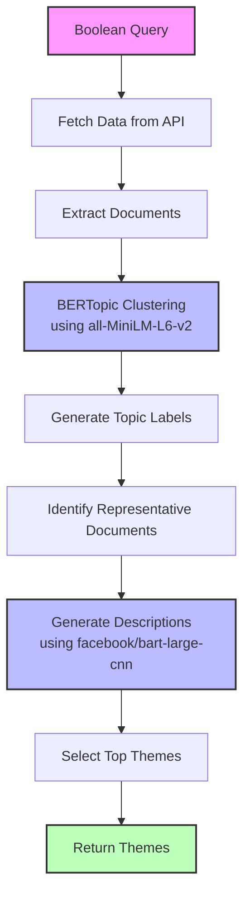
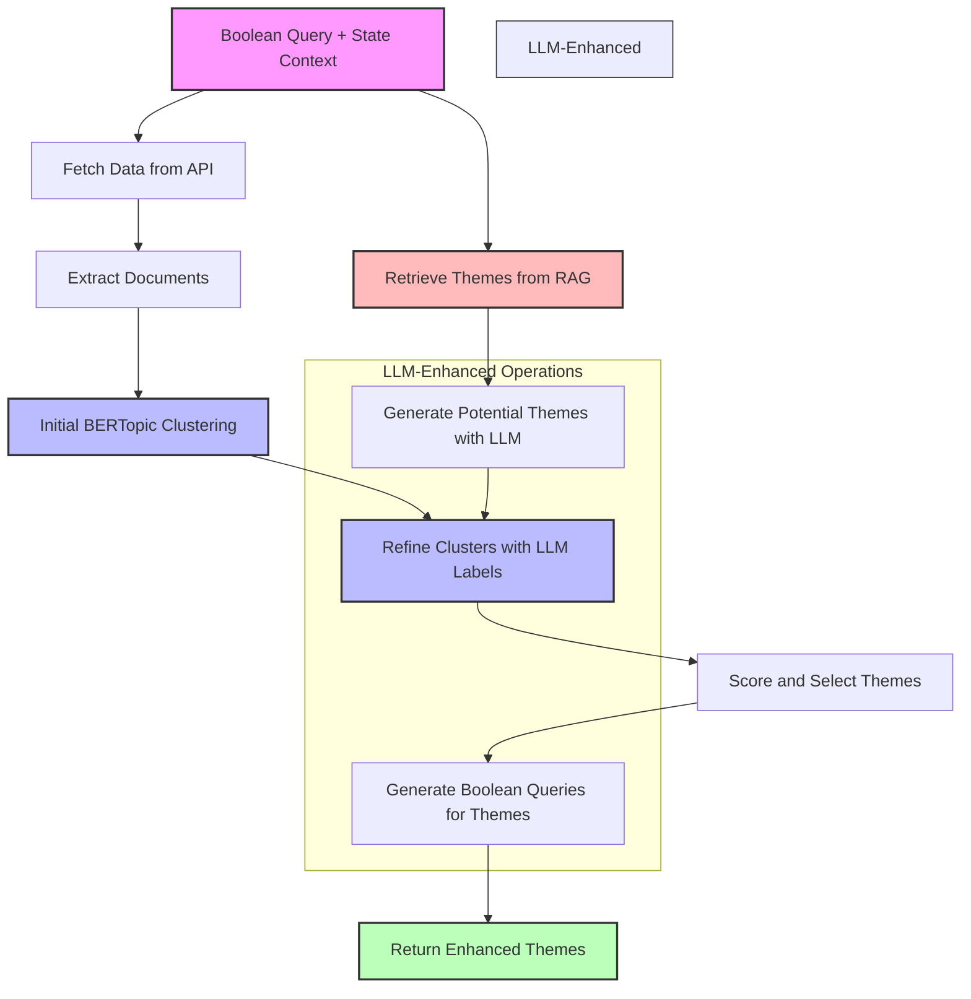

# Theme Generation Flow 1: BERTopic-only Approach

## Overview

This flow implements a straightforward approach to theme generation using BERTopic without external LLMs for theme refinement. It follows a pure unsupervised clustering approach where theme names and descriptions are derived directly from the document clusters.

## Process Description

1. **Data Collection**: Using the Boolean Query Generated, the system fetches data from the Sprinklr API
2. **Document Extraction**: The system extracts text content from each API hit, navigating through nested JSON structures to find relevant content
3. **Topic Modeling**: Using the SentenceTransformer model `all-MiniLM-L6-v2`, the system performs unsupervised clustering via BERTopic to divide data into coherent topics
4. **Theme Generation**: BERTopic's built-in methods generate topic labels (theme names) directly from the most representative terms in each cluster
5. **Description Generation**: For each topic, the most representative document is identified and summarized using the `facebook/bart-large-cnn` transformer model
6. **Theme Selection**: The top themes (up to 10) are selected based on BERTopic's internal ranking mechanisms
7. **Output**: The final themes, each with a name and description, are returned as part of the state update

## Flow Diagram



## Key Characteristics

- **Pure Unsupervised Approach**: Relies entirely on statistical methods for clustering
- **Minimal Model Dependency**: Uses only two local models (SentenceTransformer and BART)
- **Direct Topic Naming**: Themes are named directly from cluster keywords
- **Simple Architecture**: Linear processing flow without feedback loops or refinement steps
- **Resource Efficient**: Operates efficiently without requiring LLM API calls

## Example JSON

```json
{
  "query": [
    "Give Me Brand Monitoring Insights.",
    "Brand Name Apple, Channels are Twitter or Reddit."
  ],
  "refined_query": "Generate a dashboard providing real-time brand monitoring insights for Apple, including sentiment analysis, brand perception, customer experience, audience analysis, and media coverage related to the brand on Twitter and Reddit.",
  "keywords": [
    "Apple",
    "brand monitoring",
    "real-time insights",
    "sentiment analysis",
    "brand perception",
    "customer experience",
    "audience analysis",
    "media coverage",
    "Twitter",
    "Reddit",
    "love",
    "hate",
    "worst",
    "best",
    "amazing",
    "terrible",
    "broken",
    "recommend",
    "never buying again",
    "dashboard",
    "monitoring",
    "analysis",
    "insights",
    "experience",
    "coverage",
    "perception",
    "audience",
    "real-time",
    "brand",
    "customer"
  ],
  "filters": { "source": ["TWITTER", "REDDIT"] },
  "boolean_query": "Apple AND (love OR hate OR worst OR best OR amazing OR terrible OR broken OR recommend OR \"never buying again\") AND (source: TWITTER OR source: REDDIT)",
  "themes": [
    {
      "name": "-1_is_absolutely_language",
      "description": "Apple\u2019s iOS beta auto updates on iOS 7 are \u2018the worst design choice to date\u2019"
    },
    {
      "name": "0_the_apple_co",
      "description": "Use this promo code [ TPA7WGK ] and collect your free \u20a63,000 sharp sharp!"
    },
    {
      "name": "1_you_sharp_trading",
      "description": "This White House is train wreck, Scott Bessent dismisses Jamie Dimon, fights with Musk, wants to damage TESLA & Apple for some ludicrous dream to de-construct American republic. Deep Down clowns like Navaro & Bannon hate Techno-Libertarians but its like they cant do without."
    },
    {
      "name": "2_like_to_jamie",
      "description": "If #Epileptic can achieve it in just 2- years you too can have an amazing life. #Microsoft did it in 44 years. #Amazon \u2013 in 24 years \u00a0 \u00a0 \u00a0 \u00a0 \u00a0 \u00a0 \u00a0 \u00a0#Google \u2013   in 21 years \u00a0 \u00a0 \u00a0 \u00a0 \u00a0 \u00a0 \u00a0 \u00a0 #Bitcoin \u2013  in 12 years."
    }
  ]
}
```

# Theme Generation Flow 2: Hybrid BERTopic-LLM Approach

## Overview

This flow implements a sophisticated hybrid approach that combines unsupervised BERTopic clustering with LLM-enhanced theme refinement. It leverages LLM capabilities to generate natural language theme names and descriptions, and uses RAG (Retrieval-Augmented Generation) to incorporate existing theme knowledge.

## Process Description

1. **Data Collection**: Using the Boolean Query Generated, the system fetches data from the Sprinklr API
2. **Context Enrichment**: The system retrieves relevant themes from the RAG system based on the user's query and keywords
3. **Potential Theme Generation**: An LLM generates potential themes based on query context and RAG-retrieved themes
4. **Document Extraction**: Text content is extracted from API hits with enhanced content discovery
5. **Initial Clustering**: BERTopic performs unsupervised clustering using `all-MiniLM-L6-v2`
6. **Label-Guided Refinement**: The LLM-generated potential themes are used to guide the clustering through semantic similarity
7. **Confidence Scoring**: Themes are scored based on their relevance to the original query and document clusters
8. **Boolean Query Generation**: For each identified theme, an optimized boolean query is generated for further data collection
9. **Theme Selection**: The top 5-10 themes are selected based on confidence scores and diversity
10. **Output**: Final themes with names, descriptions, confidence scores, and boolean queries are returned

## Flow Diagram



## Key Characteristics

- **Hybrid Architecture**: Combines statistical clustering with LLM-enhanced generation
- **RAG Integration**: Leverages existing theme knowledge from vector database
- **Multi-stage Refinement**: Initial clusters are refined using LLM-generated labels
- **Confidence Scoring**: Implements quality metrics to ensure theme relevance
- **Boolean Query Generation**: Automatically generates optimized queries for each theme
- **Adaptive Thresholds**: Uses dynamic similarity thresholds based on document-theme distributions
- **Fallback Mechanisms**: Includes fallback to initial clustering if LLM refinement fails

- ### **Trade-offs**: High Dependency on User Context and Query Quality.

# Comparison of Theme Generation Flows

| Feature                   | Flow 1 (BERTopic-only)       | Flow 2 (Hybrid BERTopic-LLM)            |
| ------------------------- | ---------------------------- | --------------------------------------- |
| **Models Used**           | SentenceTransformer + BART   | SentenceTransformer + LLM + RAG         |
| **Theme Generation**      | Statistical (term frequency) | LLM-generated with RAG context          |
| **Theme Descriptions**    | Document summarization       | LLM-crafted descriptions                |
| **State Context Usage**   | Minimal                      | Extensive (query, keywords, filters)    |
| **Query Generation**      | None                         | Automated for each theme                |
| **Quality Control**       | Basic selection              | Confidence scoring & validation         |
| **External Knowledge**    | None                         | RAG-retrieved themes                    |
| **Architectural Pattern** | Linear pipeline              | Multi-stage with feedback loops         |
| **Fallback Strategy**     | None                         | Reversion to initial clustering         |
| **Resource Requirements** | Lower                        | Higher (LLM API calls)                  |
| **Output Richness**       | Basic themes                 | Themes with queries & confidence scores |
