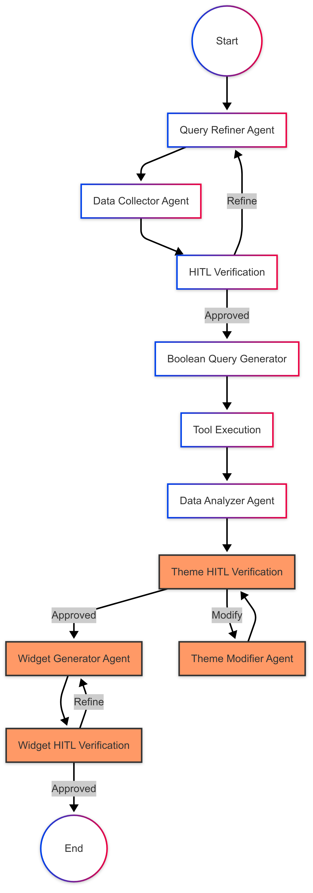

# Sprinklr Insights Dashboard (Phase 1)

## Overview

The Sprinklr Insights Dashboard is a modular, multi-agent system designed to process natural language queries and generate actionable brand monitoring insights. In Phase 1, we focus on building a robust backend workflow that:

- Refines and validates user queries using Retrieval-Augmented Generation (RAG) context
- Interacts with users via Human-in-the-Loop (HITL) for collecting missing information
- Generates optimized boolean keyword queries for the Sprinklr API
- Analyzes fetched data to identify and categorize themes
- Orchestrates the end-to-end pipeline with LangGraph
- Exposes a RESTful FastAPI API for external integration

## Architecture



**Key components:**

1. **Query Refiner Agent**: Refines raw user input into structured, filter-ready queries using RAG context.
2. **Data Collector Agent**: Engages the user interactively (HITL) to gather any missing parameters (e.g., time period, sources, etc.).
3. **HITL Verification Agent**: Presents generated filters, keywords and refined query to user for validation and approval, ensuring accuracy before execution.
4. **Boolean Query Generator Agent**: Constructs precise boolean queries for the Sprinklr API based on collected user data.
5. **ToolNode**: Executes the boolean queries to fetch raw data from Sprinklr.
6. **Data Analyzer Agent**: Processes and clusters returned data into meaningful themes, generating theme-specific boolean queries for deeper dives.
7. **FastAPI API**: Serves endpoints for submitting queries, checking workflow status, validating themes, and responding to prompts.
8. **Persistence & Memory**: Uses MongoDB and LangGraph MemorySaver to store workflow state.

## Complete Workflow Diagram


## Detailed Workflow Process

1. **API Request Handling**:

   - User submits a natural language query to `/api/process` endpoint
   - FastAPI routes the request to the workflow processor
   - A new conversation thread is created or an existing one is resumed

2. **Query Refinement**:

   - The Query Refiner Agent uses RAG context from `completeUseCase.json`
   - It structures the raw query, extracts intent, and adds default parameters
   - A refined query is produced with data requirements clearly identified

3. **Data Collection**:

   - The Data Collector Agent extracts entities, keywords, and filters
   - It uses `filters.json` for structured filter extraction
   - Produces lists of keywords and structured filter objects

4. **HITL Verification** (Human-in-the-Loop):

   - The user is presented with the refined query, keywords, and filters
   - The workflow pauses using LangGraph's `interrupt()` mechanism
   - User can approve or provide feedback for refinement
   - Based on approval analysis, the workflow either continues or routes back for refinement

5. **Boolean Query Generation**:

   - The Query Generator Agent creates optimized boolean queries
   - Uses `keyword_query_patterns.json` for query structure templates
   - Implements AND/OR/NEAR/NOT operators for precise data retrieval

6. **Tool Execution**:

   - The Boolean query is executed via the Sprinklr API tool
   - Data is fetched with specified parameters (limit, filters)
   - Results are temporarily stored (not in state) to prevent memory explosion

7. **Data Analysis**:

   - Data Analyzer processes the retrieved data using one of two flows:
     - **Flow 1**: Pure BERTopic clustering with BART summarization
     - **Flow 2**: Hybrid approach with BERTopic + LLM refinement and RAG context
   - Generates themes with names, descriptions, and boolean queries for deeper analysis

8. **Result Delivery**:
   - Final results are serialized and returned to the API
   - The full conversation state is saved in MongoDB for persistence
   - Users can retrieve conversation history via the `/api/history/{thread_id}` endpoint

## Getting Started

### Prerequisites

- Python 3.11+
- `pip` package manager
- Access to Sprinklr API credentials (configured via environment variables or `config/settings.py`)
- MongoDB instance for state persistence
- ChromaDB for RAG indices

### Installation

```bash
# Clone the repository
git clone https://github.com/your-org/insights-dashboard.git
cd insights-dashboard/server

# Install dependencies
pip install -r requirements.txt
```

### Configuration

1. Copy or update `config/settings.py` with your Sprinklr API keys, MongoDB connection string, and ChromaDB path.
2. Set environment variables in a `.env` file:
   - `HOST` (default: `0.0.0.0`)
   - `PORT` (default: `8000`)
   - `MONGODB_URI` (required for state persistence)
   - `SPRINKLR_API_KEY` (required for API access)

### Running the Server

```bash
# Start the development server
python app.py
```

By default, the API will be available at `http://0.0.0.0:8000`.

For production deployments, use an ASGI server:

```bash
uvicorn app:app --workers 4 --host 0.0.0.0 --port 8000
```

## API Endpoints

| Method | Path                       | Description                                 |
| ------ | -------------------------- | ------------------------------------------- |
| GET    | `/`                        | Service information (name, version, status) |
| GET    | `/api/health`              | Health check                                |
| GET    | `/api/status`              | Detailed service & workflow status          |
| POST   | `/api/process`             | Submit a new natural-language query         |
| GET    | `/api/history/{thread_id}` | Retrieve conversation history               |

## Data Analysis Approaches

The system implements two distinct approaches for theme generation and analysis:

### Theme Generation Flow 1: BERTopic-only Approach

A straightforward approach using unsupervised clustering with BERTopic and BART summarization:

1. Performs unsupervised clustering via BERTopic using `all-MiniLM-L6-v2` embeddings
2. Generates topic labels directly from cluster keywords
3. Identifies representative documents for each cluster
4. Uses `facebook/bart-large-cnn` to summarize representative documents for descriptions
5. Returns themes with names and descriptions

### Theme Generation Flow 2: Hybrid BERTopic-LLM Approach

A sophisticated hybrid approach combining unsupervised clustering with LLM refinement:

1. Generates potential themes using an LLM based on query context
2. Performs initial BERTopic clustering on documents
3. Refines clusters using LLM-generated labels through semantic similarity
4. Scores themes based on confidence and relevance
5. Generates boolean queries for each theme
6. Returns enhanced themes with confidence scores and queries

## Architecture Design Principles

- **Modular Components**: Each agent performs a specific function with clean interfaces
- **Conversational State**: LangGraph manages workflow state across multiple interactions
- **Human-in-the-Loop**: Built-in verification points using LangGraph's interrupt mechanism
- **Memory Efficiency**: Careful handling of large data to prevent state explosion
- **Fault Tolerance**: Error handling and fallback mechanisms throughout the workflow
- **Scalability**: Async processing and optimized state management
  | POST | `/api/themes/validate` | Validate or reject generated themes |

**Example:**

```bash
curl -X POST http://localhost:8000/api/process \
     -H 'Content-Type: application/json' \
     -d '{"query":"Give me my Brand Monitor Insights"}'
```

Refer to [USAGE.md](PROMPT.md) for a detailed end-to-end use-case example.

## Project Structure

```
server/
├── app.py              # FastAPI entrypoint
├── Architecture.pdf    # High-level system diagram
├── PROMPT.md            # Example usage & workflow description
├── README.md           # ← You are here
├── requirements.txt    # Python dependencies
├── config/             # Configuration files & environment settings
├── src/                # Core application code
│   ├── workflow.py     # LangGraph orchestration
│   ├── agents/         # Multi-agent modules
│   ├── api/            # API handlers (if split from app.py)
│   ├── helpers/        # Shared prompts, state definitions
│   ├── rag/            # RAG context retrieval logic
│   └── tools/          # ToolNode integrations
├── chroma_db/          # Persisted Chroma vector store
└── docs/               # Jupyter notebooks & additional docs
```
